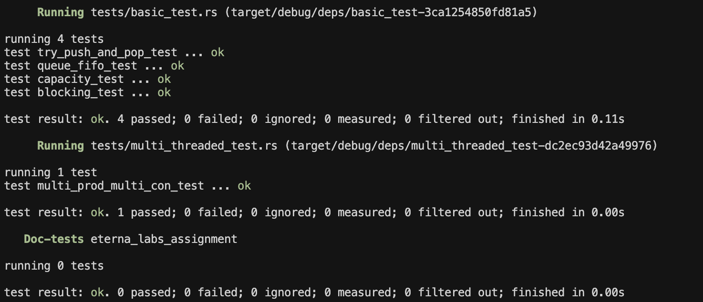
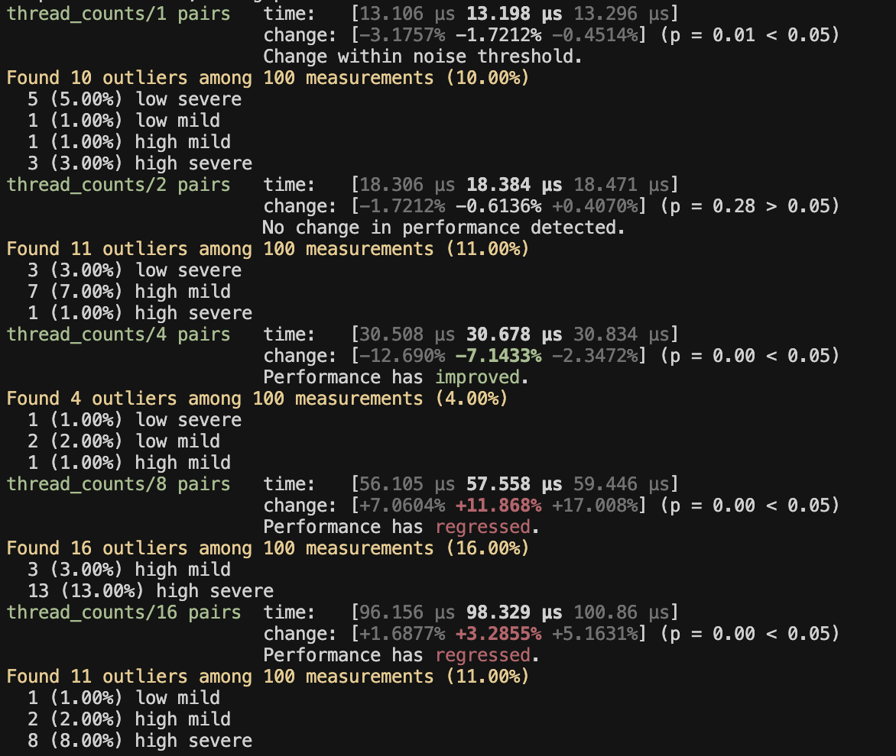
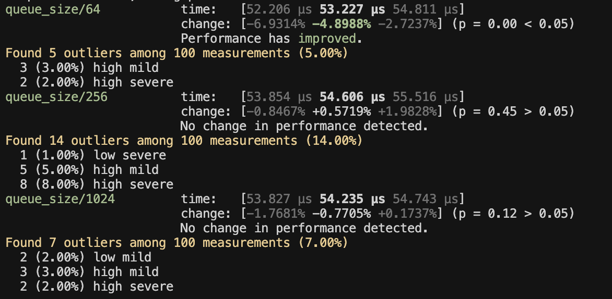
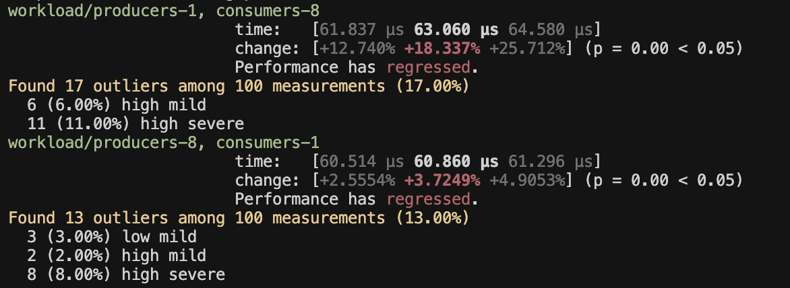

# BoundedQueue

This repository contains the implementation of a thread-safe bounded queue in Rust using `Mutex` and `Condvar` from the standard library.

## Implementation

The queue is implemented using:
- `Mutex<VecDeque<T>>`: protects shared access to the queue
- `Condvar` (not_full, not_empty): blocks and wakes threads efficiently
- No external crates: `std` only

## Given trait Object
```rust
pub trait BoundedQueue<T: Send>: Send + Sync {
    fn new(capacity: usize) -> Self;
    fn push(&self, item: T);        // blocks if full
    fn pop(&self) -> T;             // blocks if empty
    fn try_push(&self, item: T) -> Result<(), T>;  // returns Err if full
    fn try_pop(&self) -> Option<T>;                // returns None if empty
}
```

## Tests
Command:
```bash
cargo test
```

Covers:
- FIFO ordering under contention
- Capacity enforcement
- Blocking behavior
- try_push / try_pop non-blocking behavior
- No deadlock under multiple producers and consumers

Results:


## Benchmarks
Command:
```bash
cargo test
```

Measures throughput across:
- `Thread counts`: 1, 2, 4, 8, 16 producer/consumer pairs


- `Queue capacities`: 64, 256, 1024


- `Asymmetric workloads`: 8 producers / 1 consumer and 1 producer / 8 consumers


`As per the requirement all the tests and the benchmarks are completed and provided.`